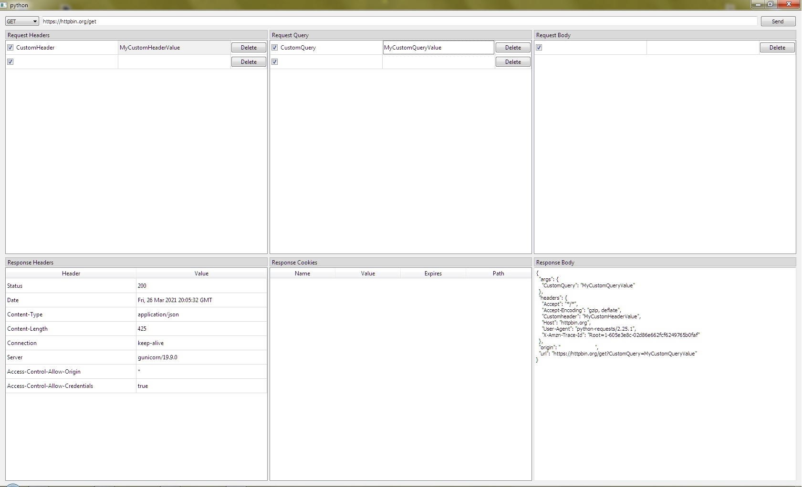
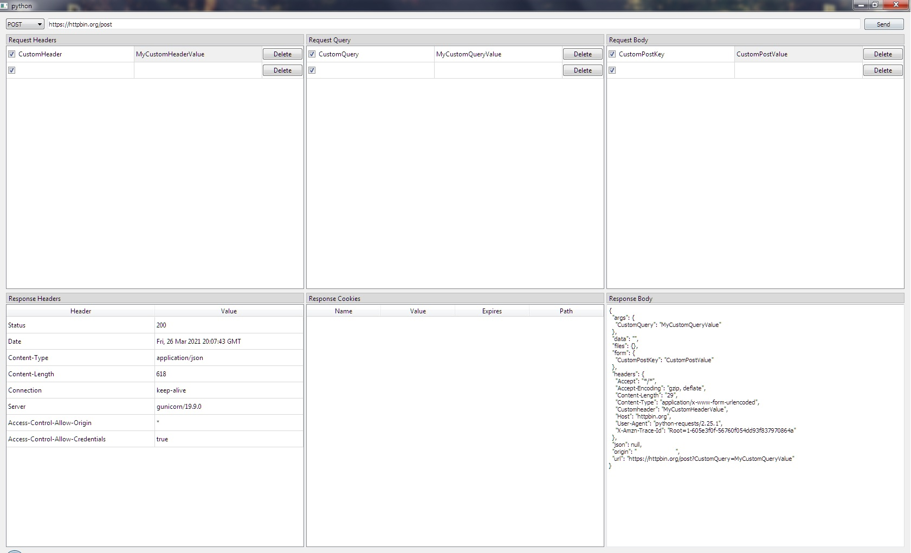
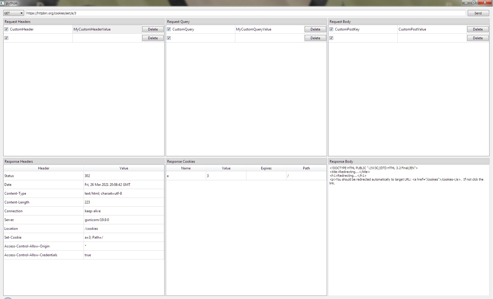

<!-- TABLE OF CONTENTS -->
## Table of Contents

* [About the Project](#about-the-project)
* [Getting Started](#getting-started)
  * [Prerequisites](#prerequisites)
  * [Installation](#installation)
* [Usage](#usage)
* [Roadmap](#roadmap)
* [Contributing](#contributing)
* [License](#license)
* [Contact](#contact)
* [Acknowledgements](#acknowledgements)


<!-- ABOUT THE PROJECT -->
## About The Project
This is an attempt to make a rest client using the Qt toolkit. There are already various great rest clients, but all of them fails in some way.This project tries to solve all of those issues.

They are OS-Specific: [Paw](https://paw.cloud/) (Mac only), [Nightingale](https://nightingale.rest/) (Windows only).

They are made with Electron, something i tend to consider as bloated: [Postman](https://www.postman.com/), [Insomnia](https://insomnia.rest/products/insomnia), [Advanced REST Client](https://chrome.google.com/webstore/detail/advanced-rest-client/hgmloofddffdnphfgcellkdfbfbjeloo?hl=en-US) (Technically not Electron, but you need Chrome to use it)

They are too developer focused like [httpie](https://httpie.io/) or you need a server to host them like [hoppscotch](https://github.com/hoppscotch/hoppscotch) (if you can live hosting i think this is one of the best)

**Why Python and Qt and not X Language and Y Toolkit?**

Python is already a great crossplatform language present in almost every unix distro, and the kind of software im building doesnt need super x10 performance. And i think Qt has a great documentation and apis to develop and prototype. In the end is just personal preference, i doesnt mean that it could not change in the future if needed.

<!-- GETTING STARTED -->
## Getting Started
### Prerequisites
* [python >= 3.7](https://www.python.org/)
* [pipenv](https://pipenv.pypa.io/en/latest/#install-pipenv-today)

### Installation

1. Clone the repo
```sh
git clone https://github.com/pudymody/rest-client-qt.git
```

2. Enter the `src` directory inside the repository
```sh
cd rest-client-qt\src
```

3. Get current Python version
```sh
python --version
```

3. Start a new python virtual environment using the version from the previous step
```sh
pipenv --python 3.7
```

4. Install all the dependencies
```sh
pipenv install
```

5. Run the program
```sh
pipenv run python main.py
```

<!-- USAGE EXAMPLES -->
## Screenshots
### Get request


### Post request


### Request with cookie response


<!-- ROADMAP -->
## Roadmap

See the [open issues](https://github.com/pudymody/rest-client-qt/issues) for a list of proposed features (and known issues).

<!-- ACKNOWLEDGEMENTS -->
## Acknowledgements

* [python](https://www.python.org/)
* [pipenv](https://pipenv.pypa.io/en/latest/)
* [PyQt5](https://pypi.org/project/PyQt5/)
* [requests](https://pypi.org/project/requests/)

<!-- CONTRIBUTING -->
## Contributing

Contributions are what make the open source community such an amazing place to be learn, inspire, and create. Any contributions you make are **greatly appreciated**.

1. Fork the Project
2. Create your Feature Branch (`git checkout -b feature/AmazingFeature`)
3. Commit your Changes (`git commit -m 'Add some AmazingFeature'`)
4. Push to the Branch (`git push origin feature/AmazingFeature`)
5. Open a Pull Request


<!-- LICENSE -->
## License

Distributed under the GPL-3.0 License. See `LICENSE` for more information.


<!-- CONTACT -->
## Contact

[Federico Scodelaro](https://pudymody.netlify.com) - [@pudymody](https://twitter.com/pudymody) - federicoscodelaro@gmail.com